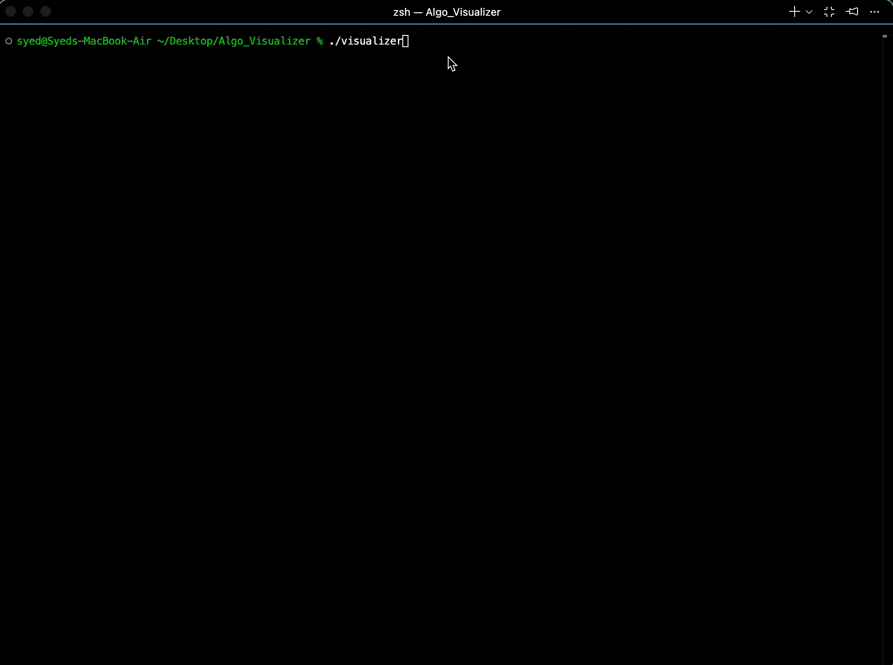

# Algorithm Visualizer

A terminal-based tool that shows you exactly what happens inside sorting algorithms — step by step, in real time, with colors to highlight what's being compared and swapped.

Built with C++. No external libraries. Just your terminal.

---

## 📽️ Demo



---

## ✨ Features

- **Step-by-step animation** — watch the algorithm work through your array one move at a time
- **Color-coded output** — 🔵 Cyan = comparing two elements, 🔴 Red = swapping or shifting
- **Your choice of input** — use a randomly generated array or type in your own numbers
- **Three algorithms included** — Bubble Sort, Insertion Sort, and Quick Sort
- **No dependencies** — compiles and runs with a single `g++` command

---

## ⚙️ Installation & Usage

### Requirements

- `g++` with C++ support
- Any terminal that supports color (macOS, Linux, or Windows WSL)

### Compile

```bash
git clone https://github.com/Myst1C13/Algorithm-Visualizer.git
cd algorithm-visualizer
```

```bash
g++ -std=c++17 -O2 src/main.cpp src/Algorithms.cpp -Iinclude -o algoviz
```

### Run

```bash
./algoviz
```

You'll be asked two things:

**1. How do you want to set up your data?**
```
--- Step 1: Data Setup ---
1. Random
2. Custom
>
```

**2. Which algorithm do you want to run?**
```
--- Step 2: Algorithm ---
1. Bubble
2. Insertion
3. Quick
>
```

The visualizer takes it from there. When it's done, your sorted array prints in green.

---

## 📊 Algorithms & Complexity

| Algorithm | Best Case | Average Case | Worst Case | Space | In-Place |
|---|---|---|---|---|---|
| Bubble Sort | Ω(n) | Θ(n²) | O(n²) | O(1) | ✅ |
| Insertion Sort | Ω(n) | Θ(n²) | O(n²) | O(1) | ✅ |
| Quick Sort | Ω(n log n) | Θ(n log n) | O(n²) | O(log n) | ✅ |

> Quick Sort uses the **Lomuto partition scheme** (rightmost element as pivot). Worst case hits on already-sorted arrays — randomized pivot is on the roadmap.

---

## 🗂️ Project Structure

```
algorithm-visualizer/
│
├── include/
│   └── Algorithms.h        # Class declaration and StepCallback type
│
├── src/
│   ├── Algorithms.cpp      # Sorting algorithm implementations
│   └── main.cpp            # Entry point, menu, and terminal renderer
│
├── .gitignore
└── README.md
```

---

## 🧠 How It Works

The visualizer and the algorithms are completely separate. Each sorting function accepts a `StepCallback` — a function that gets called every time something interesting happens (a comparison, a swap, a shift). 

The `draw()` function in `main.cpp` is passed in as that callback. So the algorithms themselves never know or care about colors or terminals — they just run, and `draw()` handles the display.

```
draw()  ──▶  bubbleSort(arr, onStep)
             insertionSort(arr, onStep)
             quickSort(arr, low, high, onStep)
               └─ partition(arr, low, high, onStep)
```

This means you could swap out `draw()` for anything — a unit test, a file logger, a GUI — without touching the algorithm code.

---

## 🚀 What's Next

- [ ] Merge Sort
- [ ] Binary Search visualization
- [ ] Adjustable animation speed (`./algoviz --speed 200`)
- [ ] Randomized pivot for Quick Sort
- [ ] Bar chart style display instead of inline brackets

---

## License

[MIT](LICENSE)

---

## Author

**Syed Mohammad Husain**
- LinkedIn: [linkedin.com/in/syedmohammadhusain](https://www.linkedin.com/in/syedmohammadhusain/)